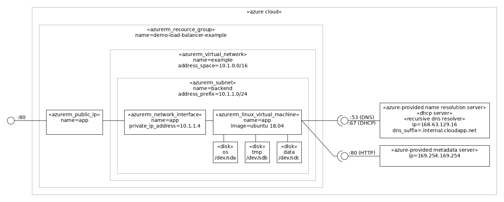

### Example Azure Ubuntu virtual machine

#### Architecture diagram

Pre:
```
cd ~/Downloads
wget https://www.umlet.com/download/umlet_14_3/umlet-standalone-14.3.0.zip
unzip umlet-standalone-14.3.0.zip
sudo apt install pngquant
```
Generate diagram:
```
make terraform-plan
```



#### Usage (on a Ubuntu Desktop)

Install the tools:

```bash
../../build-environment.sh
```

Login into azure-cli:

```bash
az login
```

List the subscriptions and select the current one if the default is not OK:

```bash
az account list --all
az account set --subscription=<id>
az account show
```

Review `main.tf` and maybe change the `location` variable.

Initialize terraform:

```bash
make terraform-init
```

Launch the example:

```bash
make terraform-apply
```

At VM initialization time [cloud-init](https://cloudinit.readthedocs.io/en/latest/index.html) will run the `provision-app.sh` script to launch the example application.

After VM initialization is done (check the boot diagnostics serial log for cloud-init entries), test the `app` endpoint:

```bash
wget -qO- "http://$(terraform output app_ip_address)/test"
```

And open a shell inside the VM:

```bash
ssh "$(terraform output app_ip_address)"
```
